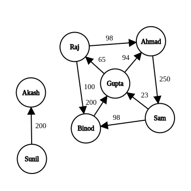
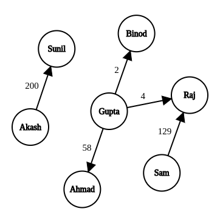
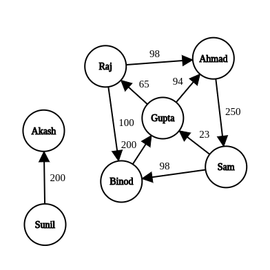
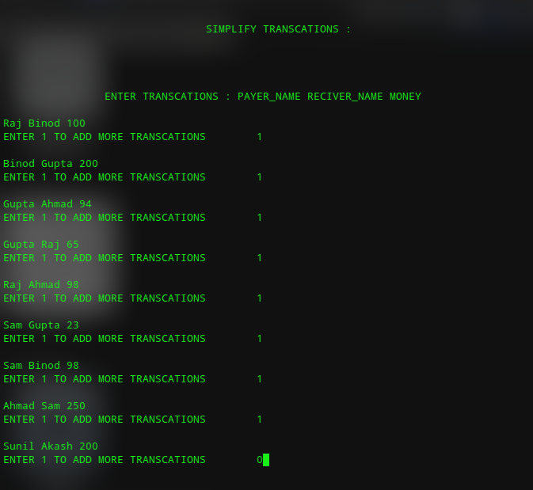
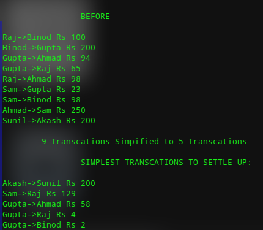

# SimplifyIt :

SimplifyIt is a tool that Suggests the Simplest Transaction's
among a given group of Transactions .
### Example :
##### Input :

##### Output :


***
## Usage :
Linux
```
./SimplifyIt
```
Other's :
>Compilation
```
g++ Simplify.cpp -o SimplifyIt
```
>Run the File SimplifyIt


---
